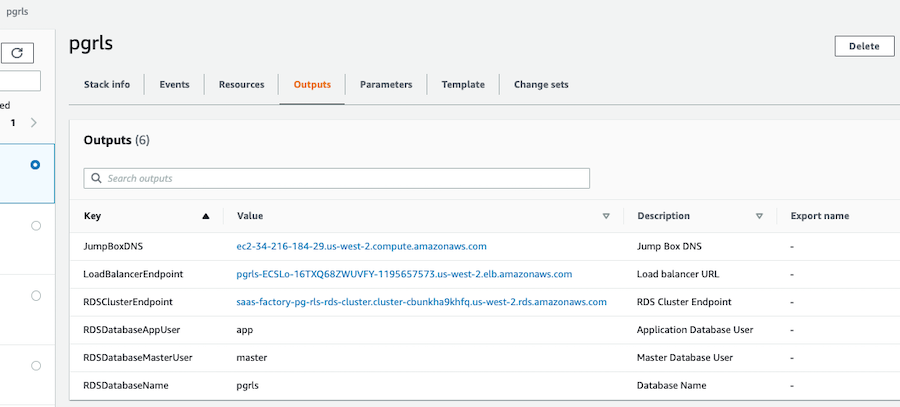

## Introduction
Checkout the article on the AWS Database Blog [https://aws.amazon.com/blogs/database/multi-tenant-data-isolation-with-postgresql-row-level-security/](https://aws.amazon.com/blogs/database/multi-tenant-data-isolation-with-postgresql-row-level-security/)

Isolating tenant data is a fundamental responsibility for Software as a Service (SaaS) providers. In this sample, produced by the AWS SaaS Factory, we show you one way to implement multi-tenant data isolation using PostgreSQL row level security policies.

## Prerequisites
You will need an AWS account that you have administrative access to in order to run the CloudFormation template. The demo creates a new VPC for its resources.

This sample creates resources in your account that are not included in the AWS free tier. Please clean up
these resources after experimenting to minimize costs.

## Getting Started
1. Simply launch the CloudFormation template [saas-factory-pg-rls.template](cfn/saas-factory-pg-rls.template) from the **cfn** folder. The stack will take a few minutes to complete.
2. If you'd like to SSH into a command line that has network access to the database and the `psql` client installed, enter a value for the EC2 keypair you'd like to use. If you don't enter a keypair, the jump box instance will not be created.
3. Enter values for the database super user name and password as well as an application user name and password.

So what did CloudFormation do? The stack created a new VPC network to isolate this sample from other resources in your account. The database passwords you chose were stored as secure parameters in Systems Manager. It then created an RDS PostgreSQL instance. Using CodeBuild, the GitHub repo was cloned and our Spring Boot sample app was built into a Docker image and pushed to the ECR repository. CodeTrail then triggered CodePipeline to deploy the image to ECS which launched it with Fargate. When the Spring sample app initializes it will bootstrap the database with the tables, RLS policies, and a login user for the app to use.

A number of resources were created in your account including:
- A new VPC with an Internet Gateway
- 2 public subnets and 2 private subnets spread across 2 availability zones
- A NAT gateway and routes in each of the public subnets
- A linux EC2 instance bastion or jump box in the first public subnet with PostgreSQL command line tools installed
- A security group allowing SSH access to the jump box
- An RDS PosgreSQL instance in a private subnet
- A security group allowing access to the RDS cluster by the jump box and by the ECS Fargate instances
- An ECR repository and an ECS cluster, task definition, and service
- A CloudWatch log group for ECS and 2 IAM roles for the task execution and the task itself
- An application load balancer with target group and listener to front the ECS service along with a security group
- A CodeBuild project and supporting S3 bucket that builds our Docker image and deploys it to the ECR repository
- A CodePipline to deploy the image from the repository to the ECS service
- A CodeTrail and supporting S3 bucket and CloudWatch event rule to trigger the pipeline when the build project completes
- IAM roles and bucket policies for the build, pipeline and trail

## See it in action
When the CloudFormation stack is completely finished, the sample environment is ready for you to experiment with. First, you need the endpoint URL for the load balancer. You can get this from the Outputs of the CloudFormation stack, or you can go to the EC2 console and find it listed under Load Balancers.

1. Once you've loaded the demo application you can go to the Admin Tenant Management section and add some tenants.
2. Next, go to the Tenant User Management section and login as one of your tenants.
3. Select the same tenant under the Manage Users for list and click the Go button.
4. Add users for this tenant.
5. Logout and repeat steps 2-4 for a different tenant.
6. Now try to manage users for a tenant different than the one you've logged in as and you'll see RLS protecting your solution from cross tenant access.

To see details of from the debugging logs, go to CloudWatch in your AWS Console and load the Log Group for **/ecs/saas-factory-pg-rls-app**.

## Time to clean up
CloudFormation cannot delete the stack until we do a little prep work. I find it easiest to do this in the AWS Console.
1. Go to CloudFormation -> select the stack you created and delete it. It will take a few minutes to delete the stack.
