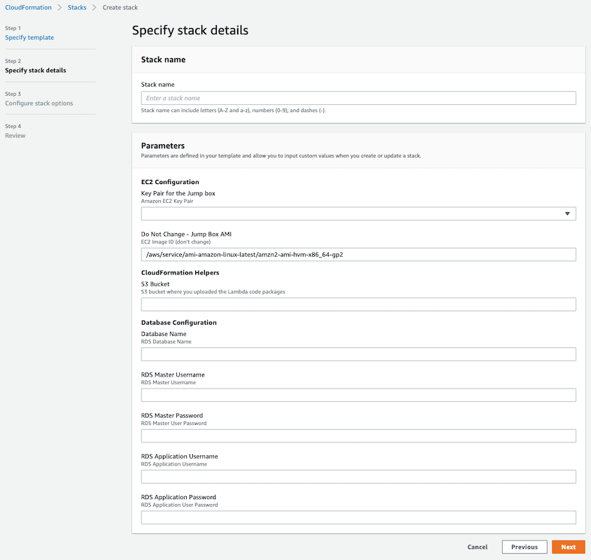

## Introduction
Isolating tenant data is a fundamental responsibility for Software as a Service (SaaS) providers. In this sample, produced by the AWS SaaS Factory, we show you one way to implement multi-tenant data isolation using PostgreSQL row level security policies.

## Prerequisites
This sample is written in Java. You will need a functioning [Java 11](https://aws.amazon.com/corretto/) install and Maven 3.x or newer to compile the Lambda functions used as CloudFormation custom resources.
You will also need an AWS account that you have administrative access to in order to run the CloudFormation templates.

This sample creates resources in your account that are not included in the AWS free tier. Please clean up
these resources after experimenting to minimize costs.

## Getting Started
1. You will need an S3 bucket in the same Region where you're going to deploy the sample. You can use an existing bucket or create a new one.

2. You will optionally need an EC2 KeyPair in the same Region where you're going to deploy the sample. You can use an existing key pair or create a new one. Provide a key pair if you want to interact with the database from the command line using psql.

3. Clone the repository and, using Maven (or your favorite IDE with Maven support), clean and package the 4 lambda projects.
```shell
git clone https://github.com/aws-samples/aws-saas-factory-postgresql-rls.git aws-saas-factory-postgresql-rls
cd aws-saas-factory-postgresql-rls/cfn/lambda
for CUSTOM_RESOURCE in $(ls -d *)
do
    cd $CUSTOM_RESOURCE
    mvn
    cd ..
done
```

4. Upload the CloudFormation template and the Lambda packages to your S3 bucket. You can use the AWS Console or the command line tools.
```shell
BUCKET=name-of-your-s3-bucket

# Move up to the cfn directory
cd ..

# Upload the 4 Lambda code packages we just compiled
find . -type f -name '*.jar' ! -name 'original-*.jar' -exec aws s3 cp {} s3://$BUCKET \;

# Upload the CloudFormation template
aws s3 cp saas-factory-pg-rls.template s3://$BUCKET
```

5. Deploy the sample using CloudFormation. There are a number of parameters used by the template including passwords for the database. You may find the AWS Console more convenient than the command line.
<p align="center"></p>

The template will take roughly 20 minutes to finish deploying.

So what did CloudFormation do? The stack created a new VPC network to isolate this sample from other resources in your account. The database passwords you chose were stored as secure parameters in Systems Manager. It then created an RDS Aurora cluster and ran a Lambda function to bootstrap the database with the tables, RLS policies, and a login user for the app to use. Using CodeBuild, the GitHub repo was cloned and our Spring Boot sample app was built into a Docker image and pushed to the ECR repository. CodeTrail then triggered CodePipeline to deploy the image to ECS which launched it with Fargate.

<p align="center"></p>

A number of resources were created in your account including:
- A new VPC with an Internet Gateway
- 2 public subnets and 2 private subnets spread across 2 availability zones
- A NAT gateway and routes in each of the public subnets
- A linux EC2 instance bastion or jump box in the first public subnet with PostgreSQL command line tools installed
- A security group allowing SSH access to the jump box
- 3 lambda functions and CloudWatch log groups for each, and an IAM execution role
- An RDS Aurora PosgreSQL 10.x cluster and parameter group with 2 instances in the private subnets
- A security group allowing access to the RDS cluster by the jump box and by the ECS Fargate instances
- An ECR repository and an ECS cluster, task definition, and service
- A CloudWatch log group for ECS and 2 IAM roles for the task execution and the task itself
- An application load balancer with target group and listener to front the ECS service along with a security group
- A CodeBuild project and supporting S3 bucket that builds our Docker image and deploys it to the ECR repository
- A CodePipline to deploy the image from the repository to the ECS service
- A CodeTrail and supporting S3 bucket and CloudWatch event rule to trigger the pipeline when the build project completes
- IAM roles and bucket policies for the build, pipeline and trail

## See it in action
When the CloudFormation stack is completely finished, the sample environment is ready for you to experiment with. First, you need the endpoint URL for the load balancer. You can get this from the Outputs of the CloudFormation stack, or you can go to the EC2 console and find it listed under Load Balancers.

<p align="center"></p>

Create a shell variable with the DNS Name for the load balancer to make the commands easier to execute.

```shell
PGRLS=http://load-balancer-endpoint-dns-name

# First, make sure we can talk to the app
curl -w "\n" $PGRLS

# The database is empty. Let's create a couple of tenants.
# We have a fake auth system - we'll just pass a magic value in the X-Tenant-ID header.
curl -s -H "Content-Type: application/json" -H "X-Tenant-ID: ADMIN" -X POST -d '{"name": "Tenant One", "status": "active", "tier": "gold"}' $PGRLS/tenants | python -m json.tool

curl -s -H "Content-Type: application/json" -H "X-Tenant-ID: ADMIN" -X POST -d '{"name": "Tenant Two", "status": "active", "tier": "gold"}' $PGRLS/tenants | python -m json.tool

# Now those tenants can create users. Capture the id's from the tenant registrations above.
curl -s -H "Content-Type: application/json" -H "X-Tenant-ID: $TENANT_ONE" -X POST -d '{"tenantId": "$TENANT_ONE", "email": "user1@tenant1.com", "givenName": "User One", "familyName": "Tenant One"}' $PGRLS/tenants/$TENANT_ONE/users | python -m json.tool

curl -s -H "Content-Type: application/json" -H "X-Tenant-ID: $TENANT_TWO" -X POST -d '{"tenantId": "$TENANT_TWO", "email": "user1@tenant2.com", "givenName": "User One", "familyName": "Tenant Two"}' $PGRLS/tenants/$TENANT_TWO/users | python -m json.tool

# And now we can see how RLS will prevent cross tenant violations
# As tenant one, ask for tenant two's users
curl -s -H "Content-Type: application/json" -H "X-Tenant-ID: $TENANT_ONE" $PGRLS/tenants/$TENANT_TWO/users | python -m json.tool

# Try to create a user under a different tenant and you'll get a 401 Unauthorized response
curl -s -H "Content-Type: application/json" -H "X-Tenant-ID: $TENANT_ONE" -X POST -d '{"tenantId": "$TENANT_TWO", "email": "tenant1user@tenant2.com", "givenName": "Cross", "familyName": "Tenant"}' $PGRLS/tenants/$TENANT_TWO/users

# Feel free to play around with other combinations of the "authenticated" tenant -- via the X-Tenant-ID
# value -- and which resource URL you try to access via GET/POST/PUT
```

## Time to clean up
CloudFormation cannot delete the stack until we do a little prep work. I find it easiest to do this in the AWS Console.
1. Go to ECS -> Repositories -> saas-factory-pg-rls and delete all images
2. Go to CloudFormation -> select the stack you created and delete it

It will take roughly 30 minutes to delete the stack.

You may also want to delete the S3 bucket and/or the copies of the Lambda packages and the CloudFormation template
